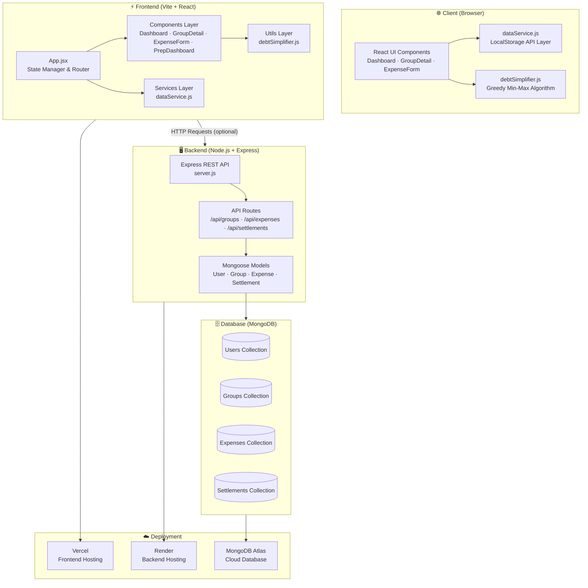
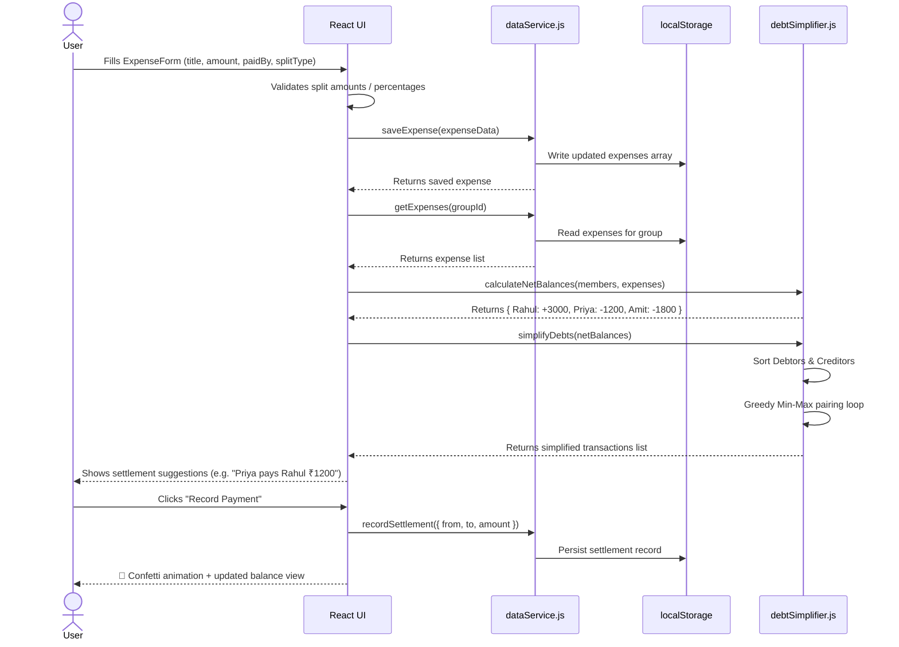

# SettleWise ⚖️


⚡ **Live Demo**: [https://settlewise-mern.vercel.app](https://settlewise-mern.vercel.app)

SettleWise is a high-fidelity, premium web application inspired by **Splitwise & SettleUp** that facilitates seamless expense tracking, group bill splitting, and debt settlements. 

The application is built as a highly responsive, modern React frontend styled with vanilla CSS glassmorphism variables. It includes a complete, document-modeled Express & Mongoose (MongoDB) backend layer to fulfill full-stack MERN engineering requirements.

---

## 🚀 Key Features

* **Real-time Context Dropdown**: A dropdown switcher in the header lets you instantly toggle between group member profiles (e.g. Rahul, Priya, Amit, Karan), immediately recalculating dashboard card metrics (Total Net, Owed overall, Owing overall) for that user context.
* **Smart Bill Splitting**: Create groups and add expenses with customized splitting logic:
  * **Equally**: Divides cost evenly among selected participants.
  * **Exact Shares**: Manually enter specific decimal currency amounts owed per member.
  * **Percentages**: Assign share values based on percentages (validated to sum to exactly 100%).
* **Greedy Debt Simplification Engine**: Built-in algorithm that reduces multi-party debt transfers into the minimum possible transactions.
* **Direct Settlement Recording**: Click "Record Payment" to settle debt between users, featuring animated celebratory confetti drops (`canvas-confetti`) on success.
* **📊 Monthly Report & Analytics**: A full analytics dashboard with:
  * Month/year navigation and group filter
  * Summary cards: Total Group Spending, Your Share, You Paid, Net Balance
  * Daily spending trend bar chart
  * Category-wise breakdown with color-coded progress bars
  * Group-wise expense split analysis
  * Top spenders leaderboard
  * Chronological expense and settlement log
  * **Print Report** button for printer-friendly output
* **Interview Prep Dashboard**: A dedicated tab built into the web app featuring live-rendered Mongoose Schemas, Express controllers code, and explanations of the transaction simplification algorithm to aid in technical interview explanations.

---

## 🛠️ Technology Stack

* **Frontend**: React.js (Vite), Lucide Icons, Canvas Confetti, custom CSS Custom Properties (Variables)
* **Backend Template Layer**: Node.js, Express.js, Mongoose (MongoDB ODM)
* **Local State Layer**: LocalStorage Service wrapper (seamlessly interchangeable with API clients)

---

## 📁 Repository Structure

```
SettleWise-MERN/
├── package.json         # React frontend dependencies
├── index.html           # Main HTML shell with SEO descriptions
├── src/
│   ├── main.jsx         # App mounting point
│   ├── App.jsx          # Root routing and global state manager
│   ├── index.css        # Premium glassmorphic dark design system
│   ├── components/
│   │   ├── Dashboard.jsx      # Overall net balance sheets and group creation
│   │   ├── GroupDetail.jsx    # Log of expenses, members list, and settleSuggestion panels
│   │   ├── ExpenseForm.jsx    # Advanced splitting modal with error validators
│   │   ├── Analytics.jsx      # Monthly report with charts, category breakdown, and print
│   │   └── PrepDashboard.jsx  # Technical cheat sheet and concept guide
│   ├── services/
│   │   └── dataService.js     # LocalStorage state layer with seed data
│   └── utils/
│       └── debtSimplifier.js  # Transaction minimization logic
└── server/              # Express API Server Boilerplate (MERN validation)
    ├── package.json
    ├── server.js        # REST controllers and MongoDB seeding script
    └── models/          # User, Group, Expense, and Settlement schemas
```

---

## 🏗️ System Architecture

### Overall Application Architecture



---

### Data Flow — Adding & Settling an Expense



---

## 🧮 Debt Simplification Algorithm

SettleWise solves the multi-party transfer loop problem (e.g. A owes B ₹500, B owes C ₹500 $\rightarrow$ A pays C ₹500 directly) using a greedy Min-Max balance matching flow.

### Implementation Outline
1. **Net Balances**: Calculate for each user $U$: $Balance(U) = Paid(U) - Owed(U)$.
2. **Partitioning**: Group users into **Debtors** ($Balance < 0$) and **Creditors** ($Balance > 0$).
3. **Sorting**: Sort both lists descending by absolute balance values.
4. **Greedy Matching**: Match the maximum debtor with the maximum creditor:
   * Settle $Amount = \min(|Debtor|, Creditor)$.
   * Create a payment Suggestion.
   * Deduct settled amount from both users, remove zeroed members, and loop.

### Computational Complexity
* **Time Complexity**: $\mathcal{O}(N \log N)$ where $N$ is the number of members in the group (due to sorting steps).
* **Space Complexity**: $\mathcal{O}(N)$ to store user credit/debit stacks.

---

## 💻 Getting Started & Run Guidelines

### Running the Frontend
Make sure you have [Node.js](https://nodejs.org/) installed, then run in the project root:

```bash
# 1. Install frontend packages
npm install

# 2. Start the Vite React hot-reload server
npm run dev
```
Open [Click Here](https://settlewise-mern.vercel.app/) in your web browser.

### Running the Express Backend (Optional)
To run the Node.js backend server with a local MongoDB instance:

```bash
# 1. Change to backend directory
cd server

# 2. Install backend packages
npm install

# 3. Spin up local Express server
npm run dev
```
*Make sure MongoDB is running locally at `mongodb://localhost:27017/settlewise` (or adjust the URI variable in `server.js`). The server will automatically seed standard trip data on startup.*

---

## 🤖 AI Co-Pilot Development Log
This application was developed using **Antigravity AI** as a pair programmer. 
* Scaffolding directories and structural imports were delegated to AI to maximize productivity.
* Mathematical algorithms (like the min-max greedy stack calculation) and CSS variable properties were designed collaboratively and vetted by the human developer to maintain strict code quality and ownership.
